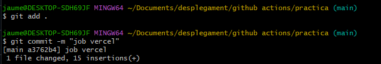

Example of nextjs project using Cypress.io

<!---Start place for the badge -->

<!---End place for the badge -->

RESULTAT DELS ÚLTIMS TESTS 

# Documentació

## Linter_job

### Creacio del repositori

### Creacio de la acció

### Push a github

### La verificacio de sintaxi de linter falla

### Arrreglada sintaxi de fitxers javascript

### La verificacio de sintaxi es un éxit

## Cypress_job

### Creacio del job

### Push a github

### El job s'efectua corectament

## Add_badge_job

### Creacio del job

### Creacio de la action add-badge-readme

### Push a github

### El job s'efectua corectament

## Deploy_job

### Creacio del projecte en vercel

### Creacio del token de vercel

### Creacio de secrets de github

### Creacio del job

### Push a github

### El job s'efectua corectament

### Desplegament de vercel

## Notification_job

### Creacio de secrets de github

### Creacio del job

### Push a github

### El job s'efectua corectament

### Se envia el email

## Metrics repositori personal

### Initzalització del repositori

### Actualitzacio readme

### Creacio de secret de github

### Creacio del job

### El job s'efectua corectament

### Metriques

# Introducció teòrica a GitHub Actions

GitHub Actions és una plataforma d’automatització que permet definir fluxos de treball dins dels repositoris de GitHub.  
Mitjançant fitxers de configuració escrits en YAML, es poden definir tasques automàtiques que s’executen quan es produeixen determinats esdeveniments, com ara un push, una pull request o fins i tot en intervals de temps programats.

Un workflow de GitHub Actions està compost per:
- **Esdeveniments (events)**: determinen quan s’executa el workflow (per exemple, quan es fa un push o cada 24 hores).
- **Jobs**: conjunts de passos que s’executen en una mateixa màquina virtual (runner).
- **Steps**: instruccions individuals que poden executar comandes o cridar altres accions.
- **Actions**: components reutilitzables que encapsulen funcionalitats concretes, com ara desplegar una aplicació, executar tests o enviar notificacions.

Gràcies a GitHub Actions es poden implementar processos d’integració i desplegament continus (CI/CD) sense necessitat d’utilitzar eines externes, millorant així la qualitat i l’eficiència del desenvolupament.
